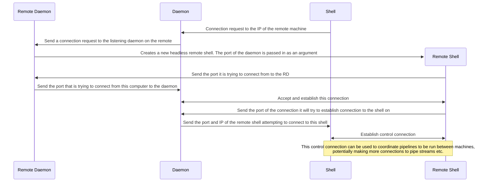

```mermaid
sequenceDiagram
  participant RD as Remote Daemon
  participant D as Daemon
  participant S as Shell
  
  S->>D: Connection request to the IP of the remote machine
  D->>RD: Send a connection request to the listening daemon on the remote

  create participant RS as Remote Shell
  RD->>RS: Creates a new headless remote shell. The port of the daemon is passed in as an argument
  RS->>RD: Send the port it is trying to connect from to the RD
  RD->>D: Send the port that is trying to connect from this computer to the daemon
  D<<->>RS: Accept and establish this connection
  RS->>D: Send the port of the connection it will try to establish connection to the shell on
  D->>S: Send the port and IP of the remote shell attempting to connect to this shell
  S<<->>RS: Establish control connection

  Note over S, RS: This control connection can be used to coordinate pipelines to be run between machines,<br/>potentially making more connections to pipe streams etc.

```